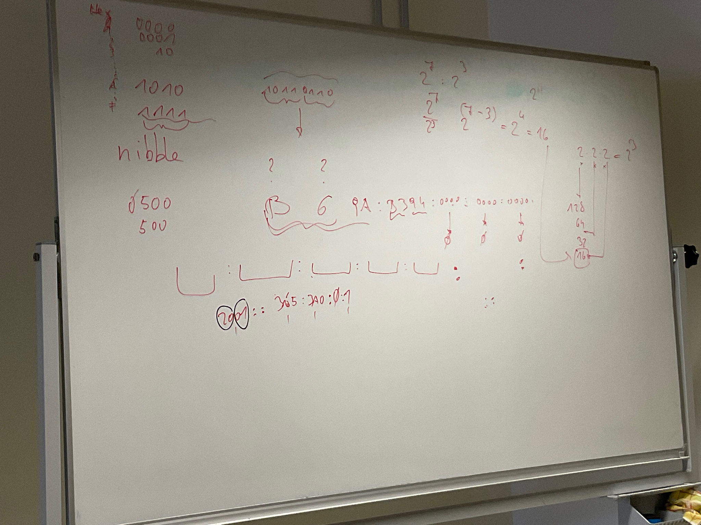
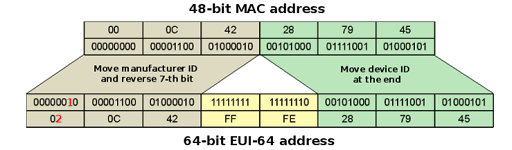
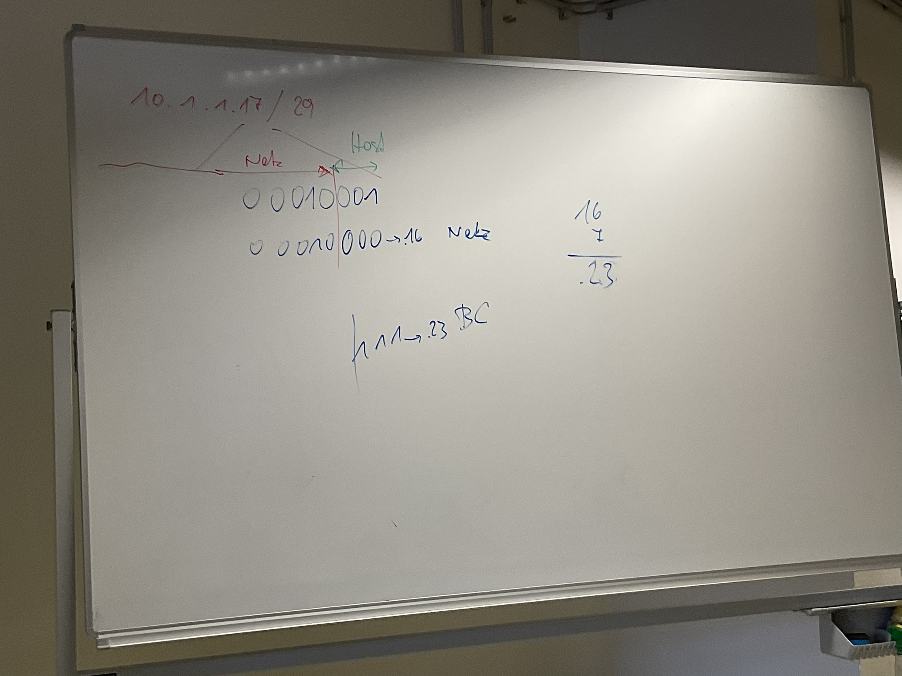

# IP
> RFC-791

> Prefix (Netz) (The ammount of network bits)

# IPv4
## Rules of Berger ipv4
* ip v4 hat 32 bits
* besteht aus netzwer und host bits
* prefixlenght ist die anzahl der netzwerkbits, der rest sind host
* Subnetmask: alle netzwerkbits sind 1, alle host bits sind 0
* netzadresse alle hostbits 0, broadcast alles hostbits 1
* alles andere sind gültige ip adressen 

## IP Classes (bevor Subnetting)

* A,B,C -> Unicast
* D -> Multicast
* E für egal (experimental)
* A has 8 Network bits /8
* B has 16 Network bits /16
* etc.

## IPv4 vs 6
* 32 bits per address
* 2^32 addresses
* doted decimal anotation
* 4 blocks (8 bits per block)
* 0.0.0.0 - 255.255.255.255

## IPv6 vs 4
* 128 bits per address
* 2^128 addresses
* hexadecimal anotation
* 8 blocks (16 bits per block)
* 0000:0000:0000:0000:0000:0000:0000:0000 - ffff:ffff:ffff:ffff:ffff:ffff:ffff:ffff

# IPv6

## Addresse Spaces
* Global Unicast    2000::/3    publicly routable, prefix /2 oder /3, ersten 3 bits identifizieren global unicast address
* Unique local      FC00::/7    Routable im LAN, FC00:: oder FD00::
* Link local        FE80::/10   Not routable, prefix FE , kommunizieren nur im einen network
* Multicast         FF00::/8    addresses for groups, prefix immer FF, vergleichbar mit Broadcast addresse die an alle schickt, nur stattdessen eine gruppe
* Anycast           2000::/3    Shared address, mehrere Hosts können den haben, Data wird zum nähersten geschickt, keine prefix
* global prefix minimum 48-bits lange, bekommt man vom ISP
* loopback ::1 /128
* localhost ::1 /128
    

## IPv6 Address shorting
* leading 0 not needed
* blocks of only 0 become :: (only once)
* 2001:1234:0ACD:0000:0000:0000:0000:0003 -> 2001:1234:ACD::3

## Localhost vs Loopback

* local host is always 127.0.0.1
* loopback can be every address
* loopback is used for network administrating
* extern ssh access an loopback

## Multicast

* FE02::1 -> any router on the network
* FE02::5 -> any OSPF router
* ....

## EUI 64

* making the mac address to the IP address
* cutting the mac address in half
* add FF:FE in the middle
* flipping the sevent bit

## IPv4 Subneting
