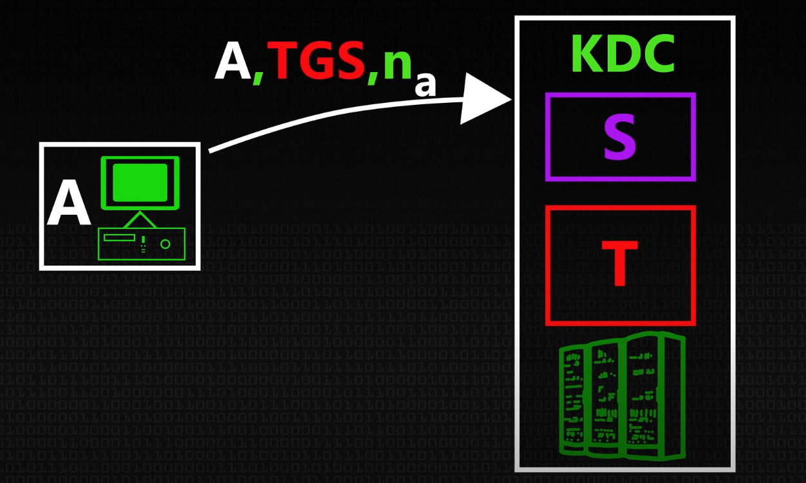
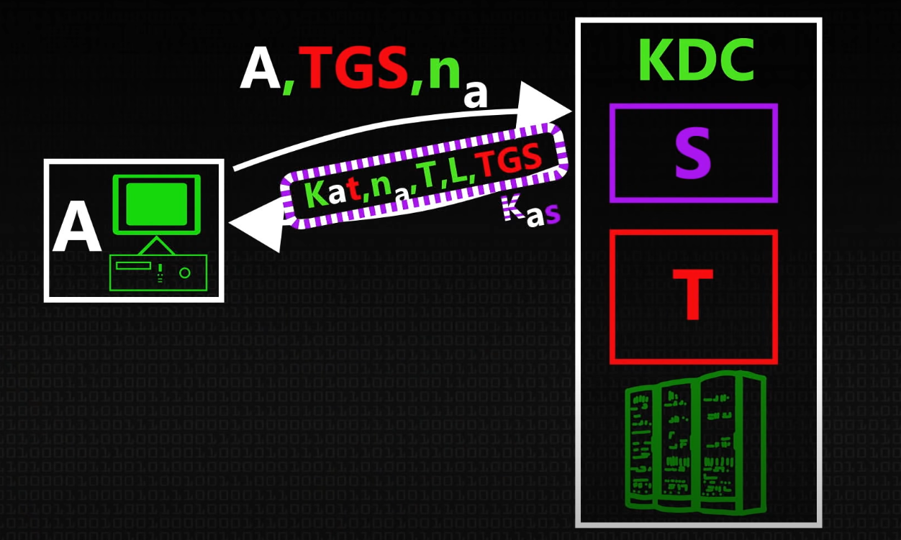
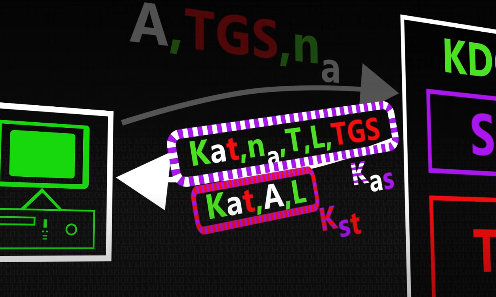
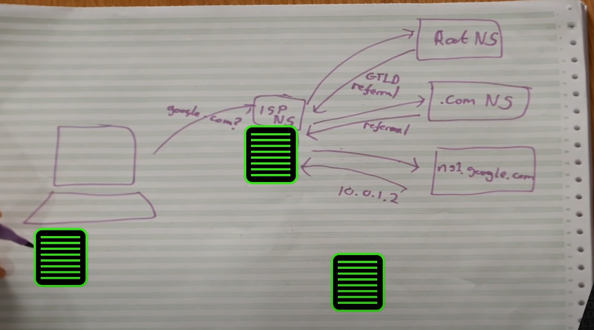
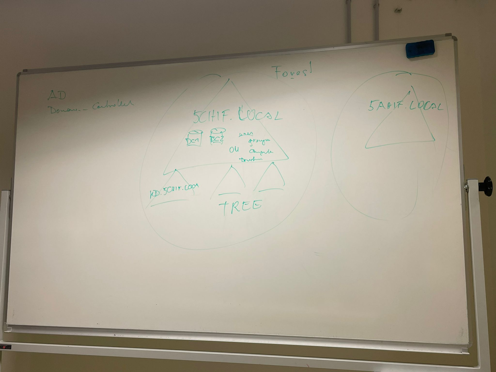
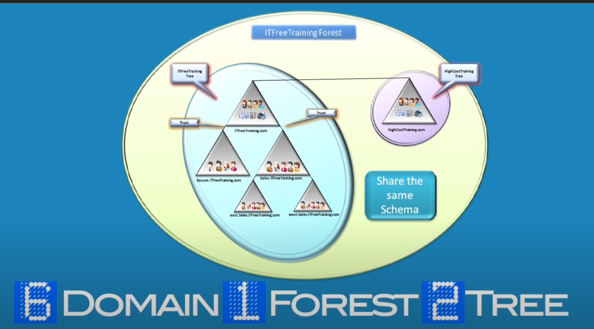

# Directory Services
## Kerberos
https://www.youtube.com/watch?v=qW361k3-BtU

* Symetric Keys based on Passwords
* KDC Key Distribution Center (performend by the Domanin Controller)
* Auhtentication Server (s)
  * checks if user data is ledigt
* Ticket Granting Server (t)
  * hands out tickets for users to communicate with printers, file server, etc

### Process

A sends a Message to the Keyserver, that it is the PC A, that it whants to speek to the ticket server and a random number(not relevant). A has a offline excanged symetric key for authentification.

* KaT Session Key between A and T (generatet by S)
* na a random number to prevent replay attacs
* T currecnt time
* L livetime of the ticket
* TGS your ok to talk to the ticket granting server
* KaS the hole message is encryted by the Key between K and S

Ticket Granting Ticket.

Because T does not have the KaT Key S randomly generatet, S also sends it encryted with SaT key to A. A sends it then to T.

## LDAP
Basically the same as Kerberos but from Microsoft
Active Directory uses Lightweight Directory Access Protocol (LDAP), which is Microsofts version of Kerberos and DNS.

## from H. P. Berger

## DNS
https://www.youtube.com/watch?v=uOfonONtIuk&t=51s

# Domain Controller AD DS
https://www.youtube.com/watch?v=cTe5GsyhKUk
* any Windows server with the role (package) AD DS installed
* contains Active Directory & Group Policy

Manages
* Users
* Computers
* Printers
* File Shares
* Groups

## setup Active Directory
* windows server
* server auf was sinvolles ändern
* add windows ROLLE "Remote Server Administrator Tools" and "AD DS Tools"
* install DNS server
* create users and groups 
* mange folders and access

## Domain Forest

## Verzeichnisdienste
> active directory domain der Schule htl-wien5.schule

* moodle
* enterprise
* wlan
* mail
* (aaa)

## aaa - Authentication, Authorization, Acounting
Possible in all threee
* Radius
* Tacacs+
* Diameter

