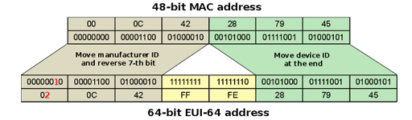

# Matura

6 Kompetensbereiche, einen darf ich verwerfen

2 kommen, 

20 minutes preperation time

5 minutes actuall test

# Domain
only the domain

Spengeragsse.at
## Fully Quallified Domain
host + domain

hub.spengergasse.at

# Mobile
## Basic
A newly turned on phone connets to the neerest Tower.

ss7 protocol

the tower (vlr) comunicates to the provider (hlr) and checks the privaleges of the user with the sim card

hlr (provider network managers) 

vlr (local network managers)

# Cybersecurity
## Executive
* FTC
* Homeland Security
* FBI
* Bundeskriminalamt

## CERT Computer Emergency Response Teams
### Österreich
* A1-Cert
* CERT.at
* WienCERT
* A-SIT (TU Graz)

## CVE Common Vulnerabilites and Exposures
Documentation of all common Vulnerabilites, categorized, hackertool 

## Honey Pots
A decoy to catch the hackers, with lots of open ports, webcams, folders

## Threats
* Maleware
* Spyware
* Botnet
* DDoS
* sniffing
* spoofing
  
# CIA 
* confidentiality
* integrity
* availability
> a game of balance in this triangle

## confidentiality
cryptography to secure the confidentiality

## Encryption Symetric
* only one key
* both have the same key
* problem with the key exchange
  
### Chesar's cipher
switch every character by two states in the alphabet

### polyalphabetic
nearly the same, but more alphabets generated by algorithmen, randomly cycled all determent by the key

## Encryption Asymetric
* public and private key
* used for key exchanges
* public key is known

## IDS intrution detection system
* erfassen Daten
* erkennen Angriffe
* schlagen Alarm

## IPS intrution prevention system
* erfassen Daten
* erkennen Angriffe
* schlagen Alarm
* handeln

### Incident Response System
Vorher festgelegte Einschrenkungen, ACL die eingespielt werden

### Systeme
* Snort
* Einstein (USA Regierung)

### Analyse Verfahern
* Signaturen Verfahren (aus alten Angriffen lernen)
* anomalie Verfahren (sachen verhalten sich nicht normal)
* Korrelationsverfahren (Machine Learning)

# IP
> Prefix (Netz) (The ammount of network bits)

## Multicast

* FE02::1 -> any router on the network
* FE02::5 -> any OSPF router
* ....

## IP Classes

* A,B,C -> Unicast
* D -> Multicast
* E für egal (experimental)
* A has 8 Network bits /8
* B has 16 Network bits /16
* etc.
* 

## Rules of Berger ipv4
* ip v4 hat 32 bits
* besteht aus netzwer und host bits
* prefixlenght ist die anzahl der netzwerkbits, der rest sind host
* Subnetmask: alle netzwerkbits sind 1, alle host bits sind 0
* netzadresse alle hostbits 0, broadcast alles hostbits 1
* alles andere sind gültige ip adressen 
  
## IPv4 vs 6
* 32 bits per address
* 2^32 addresses
* doted decimal anotation
* 4 blocks (8 bits per block)
* 0.0.0.0 - 255.255.255.255

## IPv6 vs 4
* 128 bits per address
* 2^128 addresses
* hexadecimal anotation
* 8 blocks (16 bits per block)
* 0000:0000:0000:0000:0000:0000:0000:0000 - ffff:ffff:ffff:ffff:ffff:ffff:ffff:ffff

# IPv6
## Addresse Spaces
* Global Unicast    2000::/3    publicly routable, prefix /2 oder /3, ersten 3 bits identifizieren global unicast address
* Unique local      FC00::/7    Routable im LAN, FC00:: oder FD00::
* Link local        FE80::/10   Not routable, prefix FE , kommunizieren nur im einen network
* Multicast         FF00::/8    addresses for groups, prefix immer FF, vergleichbar mit Broadcast addresse die an alle schickt, nur stattdessen eine gruppe
* Anycast           2000::/3    Shared address, mehrere Hosts können den haben, Data wird zum nähersten geschickt, keine prefix
* global prefix minimum 48-bits lange, bekommt man vom ISP
* loopback ::1 /128
* localhost ::1 /128
  
  
## IPv6 Address shorting
* leading 0 not needed
* blocks of only 0 become :: (only once)
* 2001:1234:0ACD:0000:0000:0000:0000:0003 -> 2001:1234:ACD::3

# EUI 64

* making the mac address to the IP address
* cutting the mac address in half
* add FF:FE in the middle
* flipping the sevent bit

# Protocolls
## Active Directory
* windows server
* add windows feature "Remote Server Administrator Tools" and "AD DS Tools"
* install DNS server
* create users and groups 
* mange folders and access

